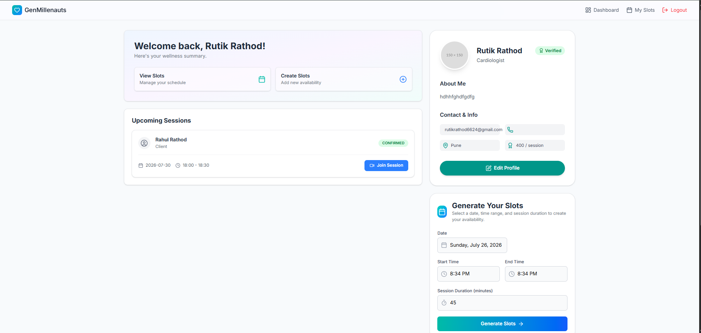
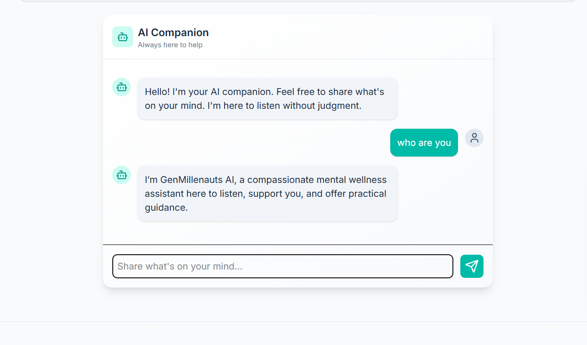
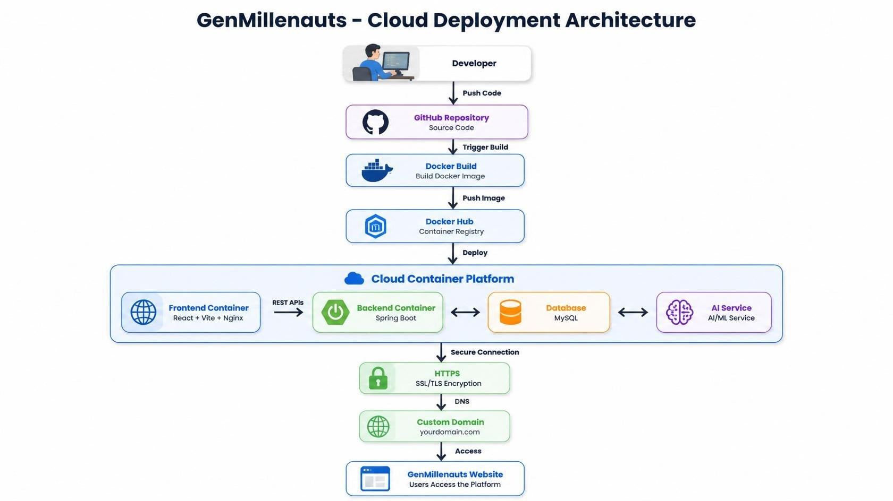

<div align="center">

# 🧠 GenMillenauts
### AI-Powered Mental Wellness Platform

A production-ready full-stack mental wellness platform built using **Spring Boot**, **React**, **Azure AI Foundry**, **Docker**, and **Azure Container Apps**.

<p align="center">
    
    
    
    
    
    
</p>

🌐 **Live Demo:** https://genmillenauts.social

</div>

---

# 📖 Overview

GenMillenauts is an AI-powered mental wellness platform designed to make mental healthcare more accessible and engaging.

Users can connect with therapists, book appointments, attend video consultations, track their daily mood, monitor stress levels, and interact with an AI assistant for emotional support.

The application is fully containerized using Docker and deployed on Microsoft Azure using Azure Container Apps with Azure Database for MySQL.

---

# 🚀 Project Highlights

- ✅ Production Ready
- ✅ Dockerized Frontend & Backend
- ✅ Azure Container Apps Deployment
- ✅ Azure Database for MySQL
- ✅ Azure AI Foundry Integration
- ✅ JWT Authentication
- ✅ Secure REST APIs
- ✅ HTTPS Enabled
- ✅ Custom Domain Configuration
- ✅ Responsive React UI

---

# 📸 Application Preview

| Home | User Dashboard |
|------|------|
|  |  |

| Therapist Dashboard | Slot Booking |
|------|------|
|  |  |

| AI Chat |
|------|
|  |

---

# ✨ Features

## 🔐 Authentication

- User Registration
- Secure Login
- JWT Authentication
- BCrypt Password Encryption
- Protected REST APIs

---

## 👨‍⚕️ Therapist Module

- Therapist Profiles
- Experience & Specialization
- Consultation Fee
- Availability Management
- Slot Management

---

## 📅 Appointment Booking

- View Available Slots
- Book Appointment
- Booking History
- Cancel Booking
- Booking Status

---

## 🎥 Video Consultation

- Online Video Consultation
- Secure Session Access

---

## 😊 Mood Tracking

- Daily Mood Logging
- Emotional Monitoring

---

## 📊 Stress Tracking

- Record Daily Stress
- AI Assisted Support

---

## 🤖 AI Chat Assistant

- Azure AI Foundry Integration
- AI Powered Conversations
- Emotional Wellness Support

---

# 🏗️ System Architecture

<p align="center">

</p>

---

# ☁️ Azure Deployment Architecture

<p align="center">

</p>

---

# 🛠️ Tech Stack

## Backend

- Java 17
- Spring Boot
- Spring Security
- Spring Data JPA
- Hibernate
- JWT
- Maven

### Frontend

- React
- Vite
- Redux Toolkit
- Axios
- CSS

### Database

- MySQL

### AI

- Azure AI Foundry

### DevOps

- Docker
- Docker Hub
- Azure Container Apps
- Nginx

### Cloud

- Azure Database for MySQL
- Azure DNS
- HTTPS / SSL
- Custom Domain

---

# 📂 Project Structure

```
GenMillenauts
│
├── frontend
├── docs
├── screenshots
├── docker
├── README.md
└── LICENSE
```

---

# 🚀 Getting Started

## Clone Repository

```bash
git clone https://github.com/ratrahu007/genMillenauts-frontend.git
```


## Frontend

```bash
cd frontend
npm install
npm run dev
```

---

# 🌍 Production Deployment

| Service | Technology |
|----------|------------|
| Frontend | React + Nginx |
| Backend | Spring Boot |
| Containers | Docker |
| Cloud | Azure Container Apps |
| Database | Azure Database for MySQL |
| AI | Azure AI Foundry |
| Domain | genmillenauts.social |
| HTTPS | SSL Enabled |

---

# 📈 Future Improvements

- Google OAuth
- Payment Gateway
- Email Notifications
- Admin Analytics
- AI Mood Prediction
- Mobile Application

---

# 👨‍💻 Author

**Rahul Rathod**

Java Full Stack Developer

- GitHub: https://github.com/ratrahu007/
- LinkedIn: www.linkedin.com/in/rahul-rathod-4742982a6

---

<div align="center">

### ⭐ If you like this project, consider giving it a Star!

Built with ❤️ using Java, Spring Boot, React & Microsoft Azure

</div>
